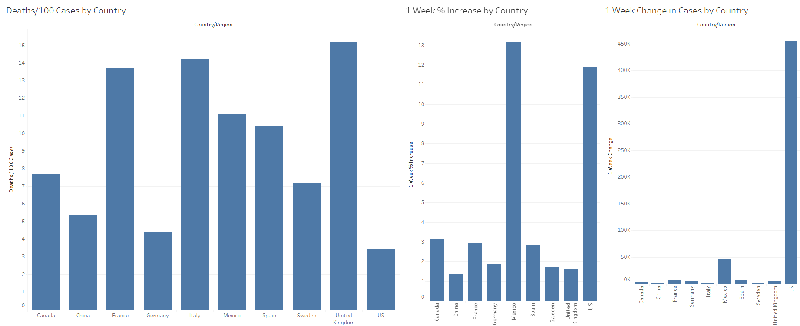

# Covid Data Visualization
An interactive data visualization using a snapshot of Covid data by country from July 2020.

**[View Tableau dashboard](https://public.tableau.com/app/profile/kendomi0/viz/covid_db/Dashboard1)**

## Technologies Used
- Tableau

## Insights
- Germany's number of death per 100 cases was notably lower compared to other European countries shown.
- Mexico and the U.S had the highest % increase in cases, while Canada, China, and the remaining European countries' numbers were significantly lower.
- The US had an extremely high difference in cases compared to other countries shown, even those with a higher population like China.